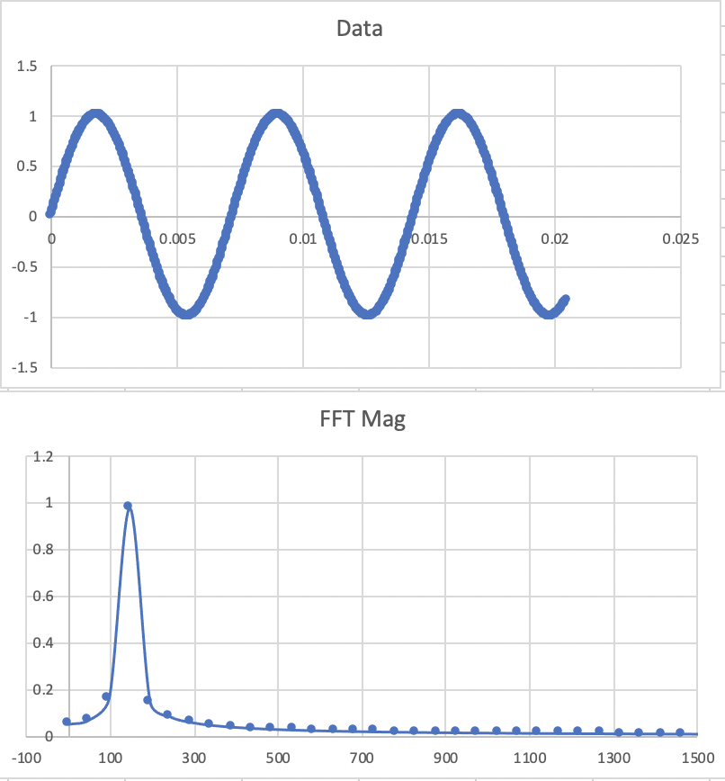

# Fast Fourier Transform in Microsoft Excel

Microsoft Excel can be used for simple as well as complex data analysis. Add-In Analysis ToolPak brings statistical and signal processsing data analysis in Excel. For installing this add-in, follow this page: https://www.exceltip.com/tips/the-analysis-toolpak-in-excel.html

In this repo, I am sharing a excel workbook with simulated data to play and understand FFT of a sinosoidal signal. The instructions are given in the pdf document originally taken from http://www.stem2.org/je/Excel_FFT_Instructions.pdf.

